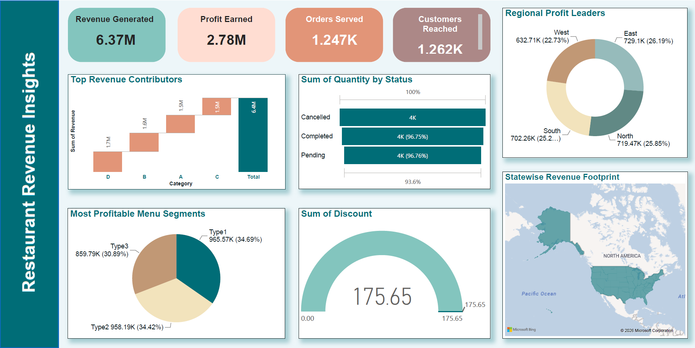

# 🍽️ Restaurant Sales Dashboard

An interactive Power BI dashboard designed to evaluate restaurant sales performance, customer dining trends, and operational efficiency.

---

## 📸 Dashboard Preview



---

## 📌 Project Overview

This project provides an end-to-end data analysis solution using Power BI and CSV/Excel data to help restaurant managers optimize menu offerings, improve peak-hour efficiency, and drive overall revenue.

* **Objective:** Monitor sales trends, track business KPIs, analyze menu item popularity, and evaluate customer feedback.
* **Tools Used:** Power BI, Microsoft Excel / CSV, DAX (Data Analysis Expressions)

---

## 📊 Key Insights & Features

* **Sales Trends & Revenue:** Breakdown of total sales over time (daily, monthly, peak hours vs. off-peak hours).
* **KPI Monitoring:** Real-time visibility into overall revenue, total orders, average bill size, and customer satisfaction ratings.
* **Product & Menu Analysis:** Performance tracking across food categories, identifying top-selling dishes and low-margin items.
* **Interactive Visualizations:** Dynamic slicers allowing deep dives into order types (dine-in, takeaway, delivery) and time periods.

---

## 📁 Repository Structure

```text
├── Dashboard-screenshot.png              # High-res Dashboard Preview
├── Dataset.csv                          # Source Data
├── README.md                            # Documentation
└── Restaurant Sales Dashboard.pbix      # Power BI Project File
