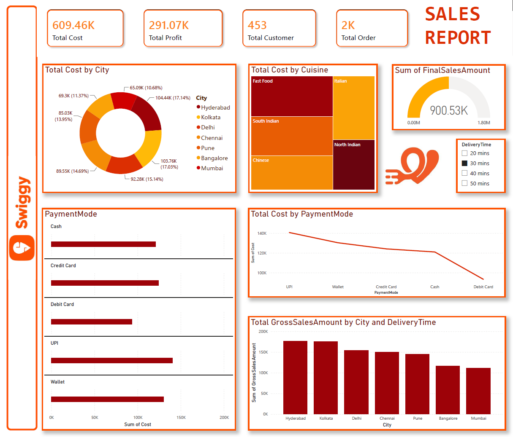

# 🛵 Swiggy Sales Analysis Dashboard

An interactive Power BI dashboard designed to analyze order performance, customer food ordering patterns, delivery insights, and revenue metrics across Swiggy partner restaurants.

---

## 📸 Dashboard Preview



---

## 📌 Project Overview

This project provides an end-to-end data analysis solution using Power BI and Excel to uncover operational efficiencies and business performance for Swiggy food orders.

* **Objective:** Track total order volume, delivery efficiency, top cuisines/restaurants, and revenue performance.
* **Tools Used:** Power BI, Microsoft Excel, DAX (Data Analysis Expressions)

---

## 📊 Key Insights & Features

* **Order & Revenue KPIs:** Real-time visibility into overall sales, total orders placed, average transaction value, and customer ratings.
* **Cuisine & Category Analysis:** Identification of top-performing cuisines, dish categories, and peak ordering times.
* **Location & Delivery Tracking:** Visual breakdown of order distribution across different city tiers and delivery metrics.
* **Dynamic Slicers:** Interactive filters to segment data by order time, location, restaurant partner, and rating.

---

## 📁 Repository Structure

```text
├── Dashboard-screenshot.png       # High-res Dashboard Preview
├── Dataset.xlsx                   # Source Data
├── README.md                      # Documentation
└── Swiggy Sales Dashboard.pbix    # Power BI Project File
